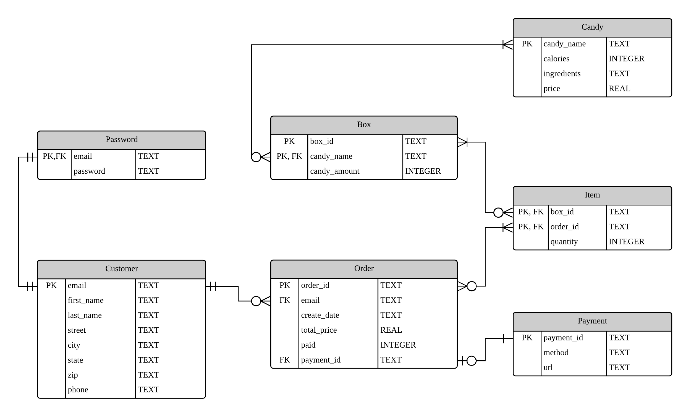

## **Assignment 4 (Group) ****Database Management Final Project**

Alice Yang, Erica Chen, Jiaxun Song, Yu-Cheng Lin

[Mr.J & Ms.A](http://mrj-and-msa-candy.herokuapp.com/) 

**Project Description**

The objective of this project is to promote a local, small candy store by building an e-commerce website. In consideration of digital divide, such a web architecture could also help the other small companies further.

Through this project, we expect to successfully build complete functions for customers to register as members, choose their favorite products including DIY boxes, and checkout the purchases following by receiving a confirmation email. Online payment methods such as paypal or actual request for credit card information will not be in the scope at this phase.

**1 Database Description**

Our database will include the data for the use of an e-commerce website. The database mainly have the information from registered customers including their names, contact information, and the orders they make if any.

We collect the data from customers’ input, and the data stored in our database will be used for the services of their online-shopping for candies from a small, local store. The interaction and connections between the entities are as the ER diagram along with all the primary keys and the formats of the data.

As for the initial test, we will have fake data for all tables except "Candy" and “Box,” both of which will have actual information already.

**1.1 Use Case**

* Register and login

    * Use table: Customer, Password

    * When users visit our website, we would let them to register as a new user or to login if they have existing account. Both of the actions would match and retrieve the data from *Customer (email, name, address…)* and *Password (email and password)* tables. The difference is that we will add new data into our database for new registered users.  

* Select candy box

    * Use table: None 

    * After users login, we provide two candy boxes for them to choose on the Buying Option page. One choice is buying default, which directs to Default Box page; the other is creating own box, which directs to Create Your Own Page. 

* Add candies into box

    * Use table: Box, Candy

    * When users buy the default candy box or create their own boxes by choosing the candies by themselve, we would merge two tables - *Box* and* Candy* - by JOIN candy_name as key.

* Add to shopping cart

    * Use table: None

    * When users finish choosing their candy box, they would add them into the shopping cart. 

* Place the order

    * Use table: Order, Item, Box, Candy

    * After users check out the shopping cart and confirm the order, we would match all the relevant product tables - *Order (order_id, email, total price, payment...)*, *Item (order_id, box_id, quantity), Box *and* Candy* - to display all the candy boxes they buy, and calculate corresponding total price.*  *

* Pay for the order 

    * Use table: Order, Payment

    * We would use *Payment (payment_id, method)* table to record the user’s payment method. Once user finish the payment, we would update the data in the *paid* column in *Order* table.

**1.2 Database Design Changes**

* Combine two tables (DefaultBox, DIYBox) into one: 

    * We changed the naming rules of both kinds of boxes into the same one *Box*, and need no additional table for DIYBox. Also we listed all the possibilities of boxes, so there will not be frequent "INSERT" executed.

* Rules of box naming: 

    * Each box id has 8 digits, e.g. "05001000", the 1st and 2nd digits represent the amount of No.1 candy -- 05, the 3rd and 4th digits represent the amount of No.2 candy -- 00, and so on.

* Used sqlite instead of mysql: 

    * The data structures are slightly changed: Using TEXT for datetime, and INTEGER 1 & 0 for True/False due to lack of Boolean.

* Partly revised the attributes:

    * For example, added "url" attribute in “Payment” table and deleted “discount” in “Order” table to meet the needs of our application.

**1.3 Problems Require Solving**

* State could be designed as an option list:

    * The "state" attribute in “Customer” table could be designed as an option list to make the attributes consistent, or some would type 2-letter states and others would do in full name.

* No restrictions of digits for "zip" and “phone”:

    * The length of the zip and phone should be restricted in order to make the data easily maintained. Also, we could check user data is fake or not by verify the length of zip and phone.

* Password is not encrypted:

    * The customer's password information is stored separately because we consider that the password may need to be encrypted. This design will facilitate our subsequent maintenance. But currently, we do not make password encrypted.

**2 Data Dictionary**

* Customer: Customer information, user input while registering

<table>
  <tr>
    <td>Key</td>
    <td>Attribute</td>
    <td>Format</td>
    <td>Note</td>
  </tr>
  <tr>
    <td>Primary</td>
    <td>email</td>
    <td>TEXT</td>
    <td></td>
  </tr>
  <tr>
    <td></td>
    <td>first_name</td>
    <td>TEXT</td>
    <td></td>
  </tr>
  <tr>
    <td></td>
    <td>last_name</td>
    <td>TEXT</td>
    <td></td>
  </tr>
  <tr>
    <td></td>
    <td>street</td>
    <td>TEXT</td>
    <td></td>
  </tr>
  <tr>
    <td></td>
    <td>city</td>
    <td>TEXT</td>
    <td></td>
  </tr>
  <tr>
    <td></td>
    <td>state</td>
    <td>TEXT</td>
    <td>Full name of states</td>
  </tr>
  <tr>
    <td></td>
    <td>zip</td>
    <td>TEXT</td>
    <td></td>
  </tr>
  <tr>
    <td></td>
    <td>phone</td>
    <td>TEXT</td>
    <td>10-digit string</td>
  </tr>
</table>

* Password: weak entity, existence depends on Customer

<table>
  <tr>
    <td>Key</td>
    <td>Attribute</td>
    <td>Format</td>
    <td>Note</td>
  </tr>
  <tr>
    <td>Primary</td>
    <td>email</td>
    <td>TEXT</td>
    <td></td>
  </tr>
  <tr>
    <td></td>
    <td>password</td>
    <td>TEXT</td>
    <td>Currently without  encryption</td>
  </tr>
</table>

* Order: orders placed by customers

<table>
  <tr>
    <td>Key</td>
    <td>Attribute</td>
    <td>Format</td>
    <td>Note</td>
  </tr>
  <tr>
    <td>Primary</td>
    <td>order_id</td>
    <td>TEXT</td>
    <td></td>
  </tr>
  <tr>
    <td>Foreign</td>
    <td>email</td>
    <td>TEXT</td>
    <td></td>
  </tr>
  <tr>
    <td></td>
    <td>create_date</td>
    <td>TEXT</td>
    <td></td>
  </tr>
  <tr>
    <td></td>
    <td>total_price</td>
    <td>REAL</td>
    <td>Derived attribute</td>
  </tr>
  <tr>
    <td></td>
    <td>paid</td>
    <td>INTEGER</td>
    <td>Indicates whether the user paid or not</td>
  </tr>
  <tr>
    <td>Foreign</td>
    <td>payment_id</td>
    <td>TEXT</td>
    <td></td>
  </tr>
</table>

* Item: bridge table connecting order and boxes

<table>
  <tr>
    <td>Key</td>
    <td>Attribute</td>
    <td>Format</td>
    <td>Note</td>
  </tr>
  <tr>
    <td>Primary, Foreign</td>
    <td>box_id</td>
    <td>TEXT</td>
    <td></td>
  </tr>
  <tr>
    <td>Primary, Foreign</td>
    <td>order_id</td>
    <td>TEXT</td>
    <td></td>
  </tr>
  <tr>
    <td></td>
    <td>quantity</td>
    <td>INTEGER</td>
    <td></td>
  </tr>
</table>

* Box: hard coded information

<table>
  <tr>
    <td>Key</td>
    <td>Attribute</td>
    <td>Format</td>
    <td>Note</td>
  </tr>
  <tr>
    <td>Primary</td>
    <td>box_id</td>
    <td>TEXT</td>
    <td>Naming rules are in the database description</td>
  </tr>
  <tr>
    <td>Primary, Foreign</td>
    <td>candy_name</td>
    <td>TEXT</td>
    <td></td>
  </tr>
  <tr>
    <td></td>
    <td>candy_amount</td>
    <td>INTEGER</td>
    <td></td>
  </tr>
</table>

* Candy: the information of single candy

<table>
  <tr>
    <td>Key</td>
    <td>Attribute</td>
    <td>Format</td>
    <td>Note</td>
  </tr>
  <tr>
    <td>Primary</td>
    <td>candy_name</td>
    <td>TEXT</td>
    <td></td>
  </tr>
  <tr>
    <td></td>
    <td>calories</td>
    <td>INTEGER</td>
    <td></td>
  </tr>
  <tr>
    <td></td>
    <td>ingredients</td>
    <td>TEXT</td>
    <td></td>
  </tr>
  <tr>
    <td></td>
    <td>price</td>
    <td>REAL</td>
    <td>Price for each candy, used to calculate the total price</td>
  </tr>
</table>

* Payment: 3 different payment methods

<table>
  <tr>
    <td>Key</td>
    <td>Attribute</td>
    <td>Format</td>
    <td>Note</td>
  </tr>
  <tr>
    <td>Primary</td>
    <td>payment_id</td>
    <td>TEXT</td>
    <td></td>
  </tr>
  <tr>
    <td></td>
    <td>method</td>
    <td>TEXT</td>
    <td>The name of payment</td>
  </tr>
  <tr>
    <td></td>
    <td>url</td>
    <td>TEXT</td>
    <td></td>
  </tr>
</table>

**3 ****Relationships Diagram - ER Diagram**

